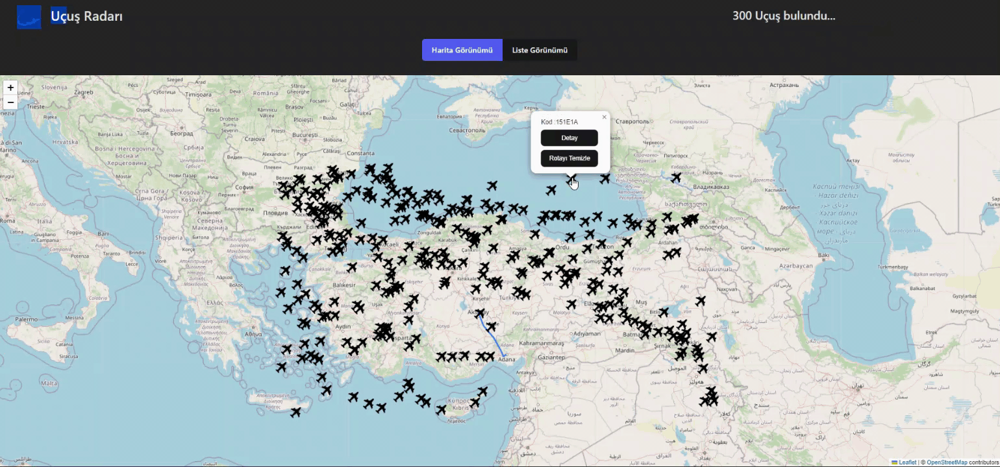

# 30_RADAR_APP_TOOLKIT_THUNK_PROJECT

With the Radar Application, which is compatible with every screen, where you can see the flight details, status and route on the map created using React libraries, users can access detailed information about the aircraft and view the flight route.

(React kütüphaneleri kullanılarak oluşturulan harita üzerinde uçuş detaylarını, durumunu ve rotasını görebileceğiniz  her ekrana uyumlu Radar Uygulaması ile kullanıcılar uçağa ait detaylı bilgilere ulaşabiliyor ve uçuş rotasını görüntüleyebiliyor.)

## Libraries
- "axios"
- "bootstrap"
- "leaflet"
- "moment"
- "react"
- "react-dom"
- "react-leaflet"
-  "react-paginate" 
- "react-redux"
- "@reduxjs/toolkit"
   
   
# API

- https://rapidapi.com/apidojo/api/flight-radar1 

# GIF

    

##  Designed by <a href="https://www.linkedin.com/in/h%C3%BCseyin-aslan-128519203/" target="_blank">Hüseyin ASLAN</a> 
    
    
    
    
    

